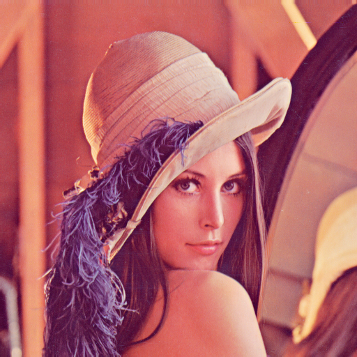
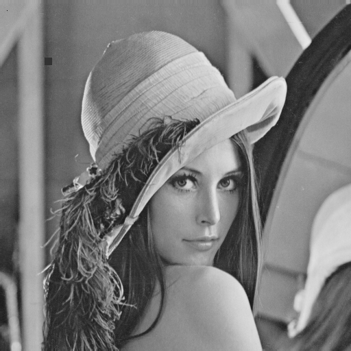

# Introduction to OpenCV – Digital Image Processing Exercises

<p align="center">    </p>

**Figure**: Color image of Lena (left); grayscale image of Lena (middle); grayscale image of Lena with modified pixel and drawn rectangle (right).

This repository contains introductory exercises for learning **Digital Image Processing Course using C++ and OpenCV**.

The goal of this exercise is to understand:

- How images are represented in memory
- How to load and convert images
- How to access and modify pixels
- How to create simple generated images

---

## 📚 Table of Contents

- [Introduction to OpenCV – Digital Image Processing Exercises](#introduction-to-opencv--digital-image-processing-exercises)
  - [📚 Table of Contents](#-table-of-contents)
  - [About OpenCV](#about-opencv)
  - [Project Overview](#project-overview)
  - [How Images Are Stored in Memory](#how-images-are-stored-in-memory)
  - [Grayscale Memory Layout](#grayscale-memory-layout)
  - [Color Image Memory Layout (BGR)](#color-image-memory-layout-bgr)
  - [Accessing Pixels Internally](#accessing-pixels-internally)
  - [Loading Images](#loading-images)
    - [Naming convention](#naming-convention)
  - [Color Conversion](#color-conversion)
  - [Image Data Types](#image-data-types)
  - [Accessing Pixels](#accessing-pixels)
  - [Modifying Pixels](#modifying-pixels)
  - [Creating a Gradient Image](#creating-a-gradient-image)
  - [Full Example Code](#full-example-code)
  - [How to Build and Run](#how-to-build-and-run)
    - [Option 1 - Using `g++` on command line](#option-1---using-g-on-command-line)
    - [Option 2 - Using CMake (inluded in the template for Linux)](#option-2---using-cmake-inluded-in-the-template-for-linux)
  - [🎓 Learning Outcomes](#-learning-outcomes)

---

## About OpenCV

We use the OpenCV library — an open-source C++ library containing many image processing and computer vision algorithms.

Key concepts:

- Most functionality lives inside the `cv` namespace
- Images are stored using the `cv::Mat` data type
- Images are stored **row by row in memory**
<!--- OpenCV uses **🔵B 🟢G 🔴R (not 🔴R 🟢G 🔵B)** ordering for color images-->
- OpenCV uses 


(not 


)

## Project Overview

This exercise demonstrates how to:

- Load a color image
- Convert it to grayscale
- Convert between data types
- Read and modify pixel values
- Draw a rectangle
- Generate a synthetic gradient image


## How Images Are Stored in Memory

An image in OpenCV (`cv::Mat`) is essentially:

```
Pointer to data + width + height + type + step size
```

Images are stored **row-major**, meaning:

- The first row is stored first in memory
- Then the second row
- Then the third row
- And so on...

Memory layout:

```
Row 0:  p(0,0)  p(0,1)  p(0,2)  ...  p(0,width-1)
Row 1:  p(1,0)  p(1,1)  p(1,2)  ...  p(1,width-1)
Row 2:  p(2,0)  p(2,1)  p(2,2)  ...  p(2,width-1)
...
```


## Grayscale Memory Layout

Grayscale image type: `CV_8UC1`

- 8 bits per pixel
- 1 channel
- Each pixel = 1 byte

Example (3×4 image):

```
Image:

[  10   20   30   40 ]
[  50   60   70   80 ]
[  90  100  110  120 ]
```

Memory layout (linear):

```
10 20 30 40 50 60 70 80 90 100 110 120
```

Access formula:

```
address = base + y * step + x
```

Where:

- `y` = row index
- `x` = column index
- `step` = number of bytes per row


## Color Image Memory Layout (BGR)

Color image type: `CV_8UC3`

- 8 bits per channel
- 3 channels per pixel
- Each pixel = 3 bytes
- Order =   

Example pixel:

```
Blue = 10
Green = 20
Red = 30
```

Memory storage:

```
[10][20][30]
```

Example (2×2 image):

```
Pixel(0,0)  Pixel(0,1)
Pixel(1,0)  Pixel(1,1)
```

Memory layout:

```
B00 G00 R00  B01 G01 R01
B10 G10 R10  B11 G11 R11
```

Linear memory:

```
p(0,0)B p(0,0)G p(0,0)R
p(0,1)B p(0,1)G p(0,1)R
p(1,0)B p(1,0)G p(1,0)R
p(1,1)B p(1,1)G p(1,1)R
```

Important:

> OpenCV uses OpenCV uses 


, not 


 ordering.


## Accessing Pixels Internally

When you write:

```cpp
gray.at<uchar>(y, x);
```

OpenCV internally computes:

```
data + y * step + x * element_size
```

For:

- Grayscale → element_size = 1
- Color → element_size = 3

This is why using correct type (`uchar`, `float`, `Vec3b`) is critical.


## Loading Images

To open an image, we use `cv::imread` function that returns an image that we can store in a variable. Images can be color or grayscale. Most of our algorithms will use grayscale images. The following code reads image in color and grayscale variant and stores them in two different variables.

```cpp
cv::Mat src_8uc3_img = cv::imread("images/lena.png", cv::IMREAD_COLOR);
cv::Mat src_8uc1_img = cv::imread("images/lena.png", cv::IMREAD_GRAYSCALE);
```

> Note: If you load image using `cv::IMREAD_GRAYSCALE`, you don't have to deal with color conversion described below.

### Naming convention

| Variable | Meaning                          |
|----------|----------------------------------|
| 8U       | 8-bit unsigned integer (uchar)   |
| C3       | 3 channels (color image)         |
| C1       | 1 channel (grayscale image)      |

That means:

8UC3 → 8-bit, 3-channel (color)

8UC1 → 8-bit, 1-channel (grayscale)


## Color Conversion

We can convert a color image to grayscale using:

```cpp
cv::cvtColor(src_8uc3_img, gray_8uc1_img, cv::COLOR_BGR2GRAY);
```

Important:
> OpenCV uses OpenCV uses 


format, not 


! Thats why there's **BRG**2GRAY.

We just converted color image `src_8uc3_img` to empty image `gray_8uc1_img` (you can create an empty image by declaring a variable, for example, as: `cv::Mat gray_8uc1_img`).


## Image Data Types

When we load an image from a file, each pixel is represented using 8 bits of information (`unsigned char` in C++ that we can refer as `uchar`). Pixel values are in range 0 - 255.
In grayscale image, we have one `uchar` per pixel.
In color image, we have three `uchars` per pixel forming traditional RGB pixels (as we've seen OpenCV uses BGR format).
However, for some image processing operations, it is better to represent image using values in range 0.0 - 1.0.
Such values have to stored in real value data type.
For our use, it’ll be completely sufficient to use `float` data type for such representation.
To convert a grayscale image from 8 bits (`uchar`)representation to 32 bits (`float`) representation we use `convertTo` method of `cv::Mat` variable.
The parameters of the method are:
- output image
- output data type
- conversion scale

By default:

- Pixel type: `uchar`
- Range: 0-255

For some algorithms, it is better to use floating point values:

- `float`
- Range: 0.0-1.0

The method may be used as follows

```cpp
gray_8uc1_img.convertTo(gray_32fc1_img, CV_32FC1, 1.0 / 255.0);
```

Explanation:

| Parameter          | Meaning                    |
|--------------------|----------------------------|
| `gray_32fc1_img`   | Output image               |
| `CV_32FC1`         | 32-bit float, 1 channel    |
| `1.0 / 255.0`      | Scaling factor             |


## Accessing Pixels

Since the main aim of this course is to implement image processing algorithms, we’ll need to access pixels of an image.
To do so, we’ll us at method of the cv::Mat data type.
This method is templated (it needs a type specifier in angle brackets before arguments).

Use the templated `at<>` method:

```cpp
at<Type>(int y, int x)
```

Example:

```cpp
uchar p1 = gray_8uc1_img.at<uchar>(y, x);
float p2 = gray_32fc1_img.at<float>(y, x);
cv::Vec3b p3 = src_8uc3_img.at<cv::Vec3b>(y, x);
```

Accessing color channels in `p3`:

```cpp
p3[0]  // Blue
p3[1]  // Green
p3[2]  // Red
```

Print values of pixels:

```cpp
printf( "p1 = %d\n", p1 );
printf( "p2 = %f\n", p2 );
printf( "p3[ 0 ] = %d, p3[ 1 ] = %d, p3[ 2 ] = %d\n", p3[ 0 ], p3[ 1 ], p3[ 2 ] );
```

We’re assigning a grayscale value (brightness) to the uchar variable `p1`. `gray_8uc1_img` has brightness values represented using 8 bits. As you can see, type specifier of at method is set to `uchar`.
It’s followed by `y`, and `x` variables that specify, at which position to read pixel value.
The same procedure is done in the case of `gray_32fc1_img` image, which uses 32 bits representation of brightness values. 
The only difference is that we use `float` instead of `uchar`
data type.
To access color pixels in `src_8uc3_img`, we need to use `cv::Vec3b`.
This type holds three values (BGR) at once.
To access each color value, we use `[]` operator as is used in the above example.


## Modifying Pixels

Another important operation with image pixels is, of course, setting a new pixel brightness.
This is done again using at method.
The only difference from the read operation is that we assign a new value to the method.

To change a pixel value:

```cpp
gray_8uc1_img.at<uchar>(y, x) = 0;  // set to black
```

We'll use this notation very often.


## Creating a Gradient Image

When implementing image processing algorithms, you’ll quite often need to go through all image pixels and perform some operation with brightness values.
To access all pixels, we usually use two nested for loops to iterate over all rows and in each row to iterate over all columns.
As an example, we’ll create a gradient image.
First, we crate a new image named `gradient_8uc1_img` with `50` rows and `256` columns and with `CV_8UC1` pixel data type.
This means that image will use 8 bits as data representation (`uchar`) and one channel, so it’s essentially a grayscale image.
Then we iterate over all pixels and assign brightness value according to the column number.

We generate a synthetic image:

* Width: 256 pixels
* Height: 50 pixels
* Type: CV_8UC1

```cpp
cv::Mat gradient_8uc1_img(50, 256, CV_8UC1);

for (int y = 0; y < gradient_8uc1_img.rows; y++) {
    for (int x = 0; x < gradient_8uc1_img.cols; x++) {
        gradient_8uc1_img.at<uchar>(y, x) = x;
    }
}
```

Result image after calling `cv::imshow( "Gradient 8uc1", gradient_8uc1_img );`:

<p align="center">  </p>

This creates a horizontal gradient from black (0) to white (255).


## Full Example Code

```cpp
#include <stdio.h>
#include <opencv2/opencv.hpp>

int main( int argc, char *argv[] )
{
    cv::Mat src_8uc3_img = cv::imread( "images/lena.png", cv::IMREAD_COLOR ); // load color image from file system into Mat variable, this will be loaded using 8 bits (uchar)

    // declare variable to hold grayscale version of img variable, gray levels wil be represented using 8 bits (uchar)
    cv::Mat gray_8uc1_img;
    // declare variable to hold grayscale version of img variable, gray levels wil be represented using 32 bits (float)
    cv::Mat gray_32fc1_img;

    cv::cvtColor( src_8uc3_img, gray_8uc1_img, cv::COLOR_BGR2GRAY ); // convert input color image to grayscale one, CV_BGR2GRAY specifies direction of conversion
    gray_8uc1_img.convertTo( gray_32fc1_img, CV_32FC1, 1.0 / 255.0 ); // convert grayscale image from 8 bits to 32 bits, resulting values will be in the interval 0.0 - 1.0

    int x = 10, y = 15; // pixel coordinates

    uchar p1 = gray_8uc1_img.at<uchar>( y, x ); // read grayscale value of a pixel, image represented using 8 bits
    float p2 = gray_32fc1_img.at<float>( y, x ); // read grayscale value of a pixel, image represented using 32 bits
    cv::Vec3b p3 = src_8uc3_img.at<cv::Vec3b>( y, x ); // read color value of a pixel, image represented using 8 bits per color channel

    // print values of pixels
    printf( "p1 = %d\n", p1 );
    printf( "p2 = %f\n", p2 );
    printf( "p3[ 0 ] = %d, p3[ 1 ] = %d, p3[ 2 ] = %d\n", p3[ 0 ], p3[ 1 ], p3[ 2 ] );

    gray_8uc1_img.at<uchar>( y, x ) = 0; // set pixel value to 0 (black)

    // draw a rectangle
    cv::rectangle( gray_8uc1_img, cv::Point( 65, 84 ), cv::Point( 75, 94 ),
                   cv::Scalar( 50 ), cv::FILLED );

    // declare variable to hold gradient image with dimensions: width= 256 pixels, height= 50 pixels.
    // Gray levels wil be represented using 8 bits (uchar)
    cv::Mat gradient_8uc1_img( 50, 256, CV_8UC1 );

    // For every pixel in image, assign a brightness value according to the x coordinate.
    // This wil create a horizontal gradient.
    for ( int y = 0; y < gradient_8uc1_img.rows; y++ ) {
        for ( int x = 0; x < gradient_8uc1_img.cols; x++ ) {
            gradient_8uc1_img.at<uchar>( y, x ) = x;
        }
    }

    // diplay images
    cv::imshow( "Gradient 8uc1", gradient_8uc1_img );
    cv::imshow( "Lena gray 8uc1", gray_8uc1_img );
    cv::imshow( "Lena gray 32fc1", gray_32fc1_img );

    cv::waitKey( 0 ); // wait until keypressed

    return 0;
}
```


## How to Build and Run

### Option 1 - Using `g++` on command line

```bash
$ g++ main.cpp -o app `pkg-config --cflags --libs opencv4`
$ ./app
```

### Option 2 - Using CMake (inluded in the template for Linux)

In Visual Studio Code, have installed CMake plugin:

```bash
$ code --install-extension ms-vscode.cpptools
$ code --install-extension ms-vscode.cmake-tools
```

Then run project by pressing: `Shift + F5`.

Or run using command line:

```bash
$ mkdir build
$ cd build
$ cmake ..
$ make
$ ./app
```


## 🎓 Learning Outcomes

After completing this exercise, you should understand:

- How images are stored in memory (row-major order)
- Difference between 1-channel and 3-channel images
- Why OpenCV uses BGR
- How `cv::Mat` manages memory
- How pixel access translates to pointer arithmetic
- The foundation of implementing custom image processing algorithms