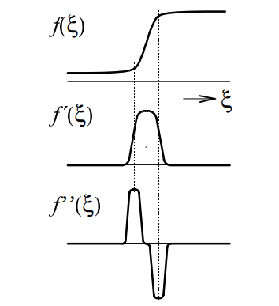

Image segmentation is an important task in image analysis.
This process extracts objects from an image background.
Since the objects often consists of another color (brightness) than the background, the image segmentation is usually based on the detection of object boundaries.
These boundaries contains edges - a location in the image where the color (brightness) function significantly changes.
Therefore, the location of edge can be determined using the derivative of the function (see Figure !ref(fig:edges)).
In this exercise, you will implement two basic edge detection methods.

{ width=40% }

## First Derivative

As it is seen in Figure !ref(fig:edges), the absolute value of first derivative is high at the image point where the edge is located.
Therefore, the edge is determined using derivatives $\partial f / \partial x$ and $\partial f / \partial y$ describing changes in the brightness function in the $x$ and $y$ directions.
Practically, we work with the images in the discrete form, therefore, the derivatives are substituted by the differences

\begin{eqnarray}
f_x(x,y) = f(x+1, y) - f(x,y)\\
f_y(x,y) = f(x, y+1) - f(x,y)
\end{eqnarray}
The size of edge is computed as
\begin{equation}
e(x,y) = \sqrt{f^2_x(x,y) + f^2_y(x,y)}.
\end{equation}
This value is computed for all image pixels.
If $e(x,y)$ is higher than a chosen threshold, it is considered as a real edge.
The result of this method (in the normalized form) can be seen in Figure !ref(fig:result)(*center*).

## Second Derivative

In Figure !ref(fig:edges), it is shown that the edge can be detected using second derivate.
The brightness function reaches the positive and negative extrema, the zero value between these two extrema determines the edge.
For this purpose, the Laplacian operator can be used.
Similarly as before, the brightness function is analyzed in the $x$ and $y$ directions, i.e. $f_{xx}=\partial^2f(x,y) / \partial x^2$, $f_{yy}=\partial^2f(x,y) / \partial y^2$. 
The Laplacian operator is defined as
\begin{equation}
\triangledown^2 f(x,y) = f_{xx}(x,y)+f_{yy}(x,y).
\end{equation}
Similarly as before, due to the discrete image domain, the derivatives are replaced by the differences in the form
\begin{eqnarray}
f_{xx}(x,y) = f(x-1, y) - 2f(x,y)+f(x+1,y)\\
f_{yy}(x,y) = f(x, y-1) - 2f(x,y)+f(x,y+1).
\end{eqnarray}
Using the Laplacian operator, the equation is in the form
\begin{equation}
\triangledown^2 f(x,y) = f(x-1, y)+f(x+1,y)+f(x, y-1)+f(x,y+1)-4f(x,y).
\end{equation}
The result of this method (in the normalized form) can be seen in Figure !ref(fig:result)(*right*).

{ width=100% }
